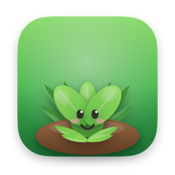
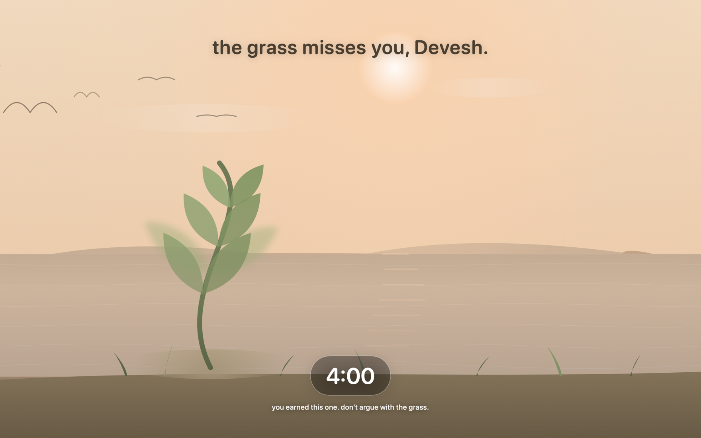
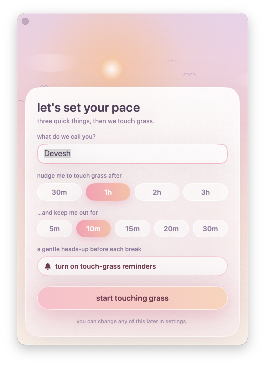
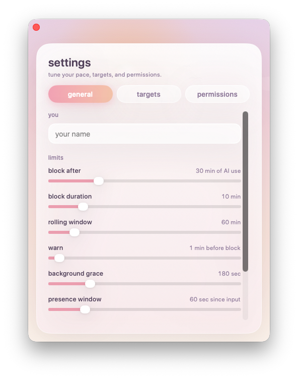

<div align="center">



# Touch Grass

**After too much AI, your Mac gently sends you outside.**

A tiny menu-bar app that notices when you've been heads-down with AI for too long —
then quietly takes over the screen with a calm little landscape and a countdown,
until you go touch some grass. 🌱

[**↓ Download for macOS**](https://github.com/Deveshb15/touch-grass/releases/latest) &nbsp;·&nbsp; macOS 13+ &nbsp;·&nbsp; Apple Silicon &amp; Intel

<br/>



</div>

<br/>

## What it is

Touch Grass lives quietly in your menu bar and keeps an eye on how much **active AI time**
you're racking up — across native apps (Claude, ChatGPT, Cursor…), terminal tools
(`claude`, `codex`, `aider`, `gemini`), and AI sites (chatgpt.com, claude.ai, perplexity…).

When you hit your limit, it gives you a one-minute heads-up, then fills every display with a
slow dawn-to-dusk landscape and a countdown. A little plant grows while you're away. When the
timer's up you're back — and so, hopefully, is your attention.

It's **firm but kind**. There's no anti-tamper daemon and nothing sketchy running in the
background; a determined you can always `killall TouchGrass`. The point isn't to trap you —
it's a nudge with a nice view.

<br/>

## A 10-second setup, then it gets out of the way

<table>
<tr>
<td width="50%" valign="top" align="center">
<br/><br/>
<b>Set your pace.</b><br/>Your name, how long you can go, and how long the break lasts.
</td>
<td width="50%" valign="top" align="center">
<br/><br/>
<b>Tune it whenever.</b><br/>Thresholds, the rolling window, what counts as “AI”, and permissions — all in one soft little window.
</td>
</tr>
</table>

<br/>

## Install

1. Download the latest **`TouchGrass-x.y.z.dmg`** from [**Releases**](https://github.com/Deveshb15/touch-grass/releases/latest).
2. Open it and drag **Touch Grass** into your **Applications** folder.
3. Launch it from Applications — look for the 🌱 in your menu bar (it has no Dock icon).

Requires **macOS 13** or later.

> **Good to know:** while a break is on, the overlay covers every display and Cmd-Tab is
> disabled for its duration — that's the point. It always clears itself on its own timer, and
> quitting mid-break just resumes the remaining time on relaunch. First time, you can set a
> tiny limit/duration in Settings to watch it work safely.

<br/>

## How it works (and your privacy)

- **Detection** runs once a second and looks at what's frontmost:
  - **Apps** are matched by bundle id.
  - A frontmost **terminal** is scanned for AI CLIs — including interpreter-hosted ones like `node …/claude`.
  - A frontmost **browser** has its active-tab URL read (via macOS Automation) and matched against AI domains.
- A second only counts when you're **actually engaged** — present (recent keyboard/mouse) at an
  AI surface, **or** an AI CLI is genuinely working in the background (burning CPU). Idle time
  and unrelated apps don't count.
- **Accumulation** is a sliding window of counted seconds, persisted — quitting and relaunching
  doesn't reset your progress.
- **The block** is a full-screen overlay on every display; its end time is persisted, so it
  survives a quit.

Everything stays **on your Mac** — no analytics, no network calls, no account. The only thing
it ever "reads" is your browser's active-tab URL, locally, to spot AI sites; macOS asks your
permission for that, once per browser, and denials are shown in **Settings → Permissions**.

<br/>

## Build from source

Requires macOS 13+, Xcode 16+, and [XcodeGen](https://github.com/yonyz/XcodeGen)
(`brew install xcodegen`).

```sh
xcodegen generate          # regenerate TouchGrass.xcodeproj from project.yml
xcodebuild -project TouchGrass.xcodeproj -scheme TouchGrass -configuration Debug build
```

Or `open TouchGrass.xcodeproj` and hit ⌘R. Signing identity is set in `project.yml`.

The app's artwork is generated, reproducibly, from small SwiftUI tools — `Tools/IconExport.swift`
(the clay-sprout app icon) and `Tools/DMGBackground.swift` (the disk-image "drag to Applications"
screen).

<br/>

## Project layout

```
project.yml                  XcodeGen spec (source of truth; .xcodeproj is generated)
Tools/                       IconExport.swift, DMGBackground.swift (reproducible art)
TouchGrass/
  App/                       @main app, AppController, Notifier, LoginItem
  Config/                    AppSettings, TargetCatalog
  Monitoring/                ActivityMonitor, CLIDetector, BrowserDetector, UsageTracker
  Blocking/                  BlockController, OverlayWindow
  Onboarding/                OnboardingWindow
  UI/                        DawnTheme, OnboardingView, SettingsView, TouchGrassView, Plant/Sky/Sun/Water/Birds
  Assets.xcassets            AppIcon
```

<br/>

<div align="center">
Made to get you off the screen for a few minutes. 🌿
</div>
